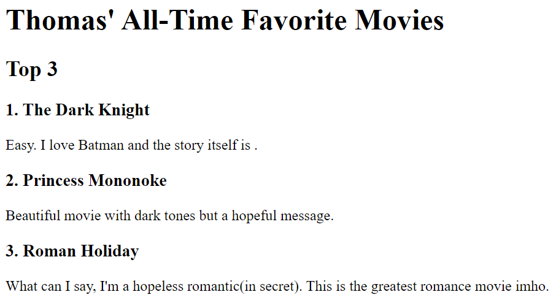

# portfolio
Web dev portfolio project

This is my personal portfolio website, and I'm thrilled to share it with you. I'm Thomas Sosa, a web developer, and this website is a showcase of my work and skills in the field of web development.

Overview
Name: Thomas Sosa
Occupation: Web Developer

Projects:

1. Movie Ranking Project

Description: This project is a movie ranking webpage developed by me. It allows users to rank their favorite movies.
Click the link above to view the project.

2. Birthday Invite Project

Description: I created this project for birthday invitations. It provides details about the celebration and includes an interactive Google Maps link.
Click the link above to view the project.
About Me and Contact
About Me: Learn more about me, my background, and my interests.
Contact Me: Get in touch with me if you have any inquiries or would like to collaborate.
Navigation
The portfolio includes easy navigation to explore the various sections and projects. Additionally, a solid horizontal line separates the different sections for clarity.

Usage
Feel free to explore the portfolio by clicking the provided links to my projects and other sections.

